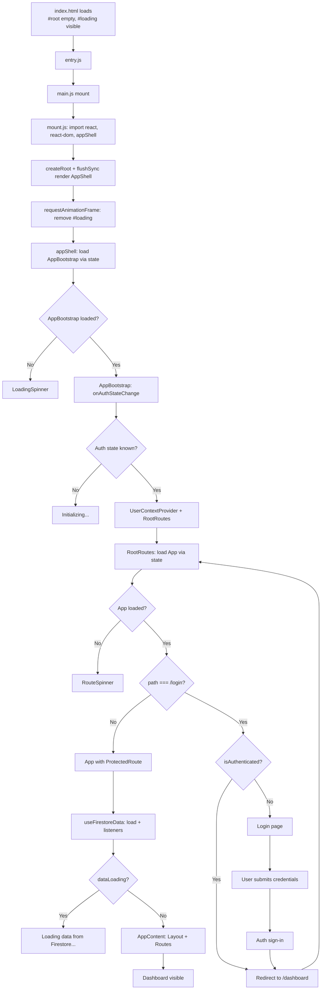

# ZenFlow Spa Manager — Project Master Map

**Purpose:** Ultimate study guide for admins and developers.  
**App:** [ZenFlow Spa Manager](https://razak-residence-2026.web.app/) (Firebase Hosting).

---

## 1. System Blueprint

| Layer | Technology | Role |
|-------|------------|------|
| **Frontend** | React 19 + TypeScript | SPA with HashRouter; UI in `zenspa backend/` (no top-level `src/`). |
| **Auth** | Firebase Authentication | Email/password; `onAuthStateChange` in `AppBootstrap`; user identity only. |
| **Database** | Cloud Firestore | Multi-tenant by `outletId`; real-time listeners via `useFirestoreData`; rules enforce outlet + role (admin/cashier). |
| **Hosting** | Firebase Hosting | Build: `vite build` → `dist/`; deploy: `firebase deploy --only hosting`. |

**Multi-tenant model:** Each user has a document in `users/{uid}` with `outletId` and `role`. All Firestore reads/writes are scoped to that outlet. Cashiers are restricted to SALE transactions (enforced in Firestore rules).

---

## 2. Folder Dictionary

Application code lives under **`zenspa backend/`**. Major folders:

| Folder | Responsibility |
|--------|----------------|
| **`pages/`** | Route-level screens: Dashboard, POS, CRM, Staff, Services, Appointments, Finance, Transactions, Sales Reports, Settings, Login, MemberDetails, ExternalIntegrations. |
| **`components/`** | Reusable UI: Layout, ErrorBoundary, ProtectedRoute, Toast, CreditWalletModal, PointsHistoryModal, TransactionDetailModal. |
| **`contexts/`** | React context: `UserContext` (user profile, outletId, role, outletName). |
| **`hooks/`** | `useAuth` (Firebase Auth), `useFirestoreData` (Firestore CRUD + real-time), `useMemberDetailsData`. |
| **`services/`** | API & Firebase: `authService`, `firestoreService`, `pointTransactionService`, `storageService`, `setmoreSyncService`, `socketService`, `geminiService`. |
| **`types.ts`** | Shared TypeScript types (Client, Staff, Appointment, Transaction, Service, Product, Package, Reward, etc.). |
| **`functions/`** | Firebase Cloud Functions (e.g. Setmore sync, callable endpoints). |

**Root-level entry chain:** `entry.js` → `main.js` → `mount.js` → `appShell.tsx` → `AppBootstrap.tsx` → `RootRoutes.tsx` → `App.tsx`.

---

## 3. Application Lifecycle (main.tsx → Dashboard)

There is no `main.tsx`; the app is bootstrapped via **`entry.js`**. Flow from first script to Dashboard:

| Step | What happens |
|------|-----------------------------|
| 1 | **index.html** loads; `
` is empty; `
` shows “Loading ZenFlow…”. |
| 2 | **entry.js** runs (no static imports). It dynamically imports **main.js** and calls `mount()`. |
| 3 | **main.js** has no static imports. Its `mount()` dynamically imports **mount.js** and calls its `mount()`. |
| 4 | **mount.js** uses dynamic imports for `react`, `react-dom/client`, and **appShell**. It guards against double mount (`rootElement._reactRoot`), creates root with `createRoot`, renders **AppShell** inside `flushSync` (to avoid removeChild races), then in `requestAnimationFrame` removes the **#loading** div. |
| 5 | **appShell.tsx** wraps the app in `ErrorBoundary` and `HashRouter`. It does **not** use React Suspense for the main app: it keeps `AppBootstrap` in local state and loads it with `import('./AppBootstrap').then(...)`. Until loaded, it shows a **LoadingSpinner**. |
| 6 | **AppBootstrap.tsx** subscribes to Firebase Auth via `onAuthStateChange` and shows “Initializing…” until the first auth state is known. Then it renders **UserContextProvider** and **RootRoutes** (RootRoutes is lazy with Suspense fallback). |
| 7 | **RootRoutes.tsx** uses `useAuth()`. It loads **App** via state (`import('./App').then(...)`), not Suspense, and shows **RouteSpinner** until App is ready. Routes: `/` → redirect to `/login`; `/login` → Login (or redirect to `/dashboard` if authenticated); `*` → App. |
| 8 | **App.tsx** is only rendered for authenticated users on `*`. It uses **ProtectedRoute**, **useUserContext()** (outletId, role), and **useFirestoreData(outletId, role)**. While **useFirestoreData** is loading (`dataLoading`), App shows “Loading data from Firestore…”. When done, it renders **AppContent** (Layout + Routes). |
| 9 | **Dashboard** is the default tab/route. Its entry component is **`pages/Dashboard.tsx`**, rendered inside Layout when the user is authenticated, has an outlet, and Firestore data has finished loading. |

**Loading state summary:**  
- **AppBootstrap** = “Initializing…” (auth state).  
- **appShell** = spinner until AppBootstrap module is loaded.  
- **RootRoutes** = spinner until App module is loaded.  
- **App** = “Loading data from Firestore…” until `useFirestoreData` has completed its initial load.  
The initial HTML **#loading** div is removed in **mount.js** after the first React paint.

---

## 4. Feature Directory (Entry Points)

| Feature | Route / Tab | Entry point file |
|---------|-------------|-------------------|
| Login | `/login` | `zenspa backend/pages/Login.tsx` |
| Dashboard | `/dashboard` (default) | `zenspa backend/pages/Dashboard.tsx` |
| POS | `/pos` | `zenspa backend/pages/POS.tsx` |
| CRM (Members) | `/crm` | `zenspa backend/pages/CRM.tsx` |
| Member details | `/member-details/:id` | `zenspa backend/pages/MemberDetails.tsx` |
| Staff | `/staff` | `zenspa backend/pages/Staff.tsx` |
| Services (Menu) | `/services` | `zenspa backend/pages/Services.tsx` |
| Appointments | `/appointments` | `zenspa backend/pages/AppointmentsCalendar.tsx` |
| Transactions | `/transactions` | `zenspa backend/pages/Transactions.tsx` |
| Sales Reports | `/sales-reports` | `zenspa backend/pages/SalesReports.tsx` |
| Finance | `/finance` | `zenspa backend/pages/Finance.tsx` |
| Settings | `/settings` | `zenspa backend/pages/Settings.tsx` |
| External integrations | `/settings/integrations` | `zenspa backend/pages/ExternalIntegrations.tsx` |

All these pages are lazy-loaded in **App.tsx** via `React.lazy(() => import('./pages/...'))` and rendered inside **AppContent** (Layout + Routes).

---

## 5. Data Architecture

### UserContext (global auth + outlet state)

- **Provider:** `contexts/UserContext.tsx` — wraps the app inside **AppBootstrap** (after auth is known).
- **Source of truth:** Firebase Auth (user) + Firestore `users/{uid}` (outletId, role) and optionally `outlets/{outletId}` (name). User document is read with `getDocFromServer` so role/outlet changes apply immediately.
- **Exposed:** `user`, `userData`, `outletId`, `outletName`, `role` (admin | cashier), `loading`, `error`, `refreshUserData()`.
- **Usage:** Any screen under App can call `useUserContext()` to get outletId and role; **useFirestoreData(outletId, role)** relies on this for multi-tenant data and permission-safe queries.

### Firestore real-time updates

- **Hook:** `hooks/useFirestoreData.ts`. Called from **App.tsx** with `outletId` and `role` from UserContext.
- **Behavior:** Sets `setCurrentOutletID(outletId)` for firestoreService and pointTransactionService. For each entity (clients, staff, appointments, transactions, services, products, packages, rewards), it attaches Firestore **onSnapshot** listeners scoped to the current outlet (and for transactions, cashiers only get SALE type).
- **Result:** When data changes in Firestore (from this app or elsewhere), the hook state updates and the UI re-renders without a full refresh. All CRUD handlers in the hook perform Firestore writes and are then updated by the same listeners.

---

## 6. Development Standards

### Core stack

- **Build:** Vite 6
- **UI:** React 19, TypeScript, Tailwind CSS, Lucide Icons (`lucide-react`)
- **Routing:** react-router-dom (HashRouter)
- **Backend:** Firebase (Auth, Firestore, Hosting, Cloud Functions)

### Rules for adding features

1. **Lazy loading:** New top-level pages should be added with `React.lazy(() => import('./pages/...'))` in **App.tsx** and rendered in the same way as existing features to keep initial bundle small and avoid build OOM.
2. **No circular dependencies:** Entry chain uses **dynamic imports** (entry.js → main.js → mount.js → appShell → AppBootstrap → RootRoutes → App). Avoid importing App or Firebase-heavy modules from entry/main/mount.
3. **Direct imports:** Use direct file imports (e.g. `./services/firestoreService`) rather than barrel files that re-export large trees, to reduce risk of circular dependencies and build memory.
4. **Multi-tenant:** All Firestore access must use the authenticated user’s `outletId` from UserContext; never hardcode or default outletId for data.
5. **Roles:** Use `role` from UserContext when querying or mutating; Firestore rules enforce admin vs cashier (e.g. cashiers limited to SALE transactions).

---

## 7. Visual Flowchart — Login to Dashboard

---

*Document generated for ZenFlow Spa Manager. Root directory: `1. ZenSpa`; application root: `zenspa backend/`.*
